<div align="center">

<!-- HERO BANNER SVG — upload this to your repo as assets/banner.svg -->


<br/>

### `N I K H I L` · AI Engineer · Builder · Your friendly neighbourhood tech guy 🕷️

[](https://portfolio-weld-six-45.vercel.app/)
[](https://linkedin.com/in/m-nikhil-126690289)
[](mailto:nikhilchowdary334@gmail.com)

</div>

---

## ◈ SUIT.ID — NIKHIL_AI · v2.6.0

```python
class NikhilAI:
    designation  = "AI Product Developer Intern @ Rooman Technologies"
    mission      = "Ship production-grade AI — not demos, not notebooks."
    builds       = ["LLM Pipelines", "Voice Agents", "RAG Systems", "AI SaaS"]
    active_build = "GhostFolio — AI Startup Revival Intelligence Platform"
    targeting    = ["AI Engineer", "Software Engineer", "AI/SWE Intern roles"]
    
    def status(self): return "🔴 ONLINE · Bangalore, India"
```

---

## ◈ DEPLOYED SYSTEMS

<table>
<tr>
<td width="50%" valign="top">

### 🔴 [GhostFolio](https://ghostfoliov2.vercel.app)
**AI Startup Revival Intelligence Platform**

Ingests failed startup data → runs Gemini API analysis → outputs revival strategies, TAM scores, pivot vectors & viability ratings.

`React` `Gemini API` `Supabase` `Vercel`

**STATUS:** `LIVE`

</td>
<td width="50%" valign="top">

### 🟠 Voice Agent
**Real-time Multi-Persona STT→LLM→TTS**

Streaming voice pipeline with live persona switching. Resolved async deadlocks, interruption handling & silent handoffs in production.

`Python` `FastAPI` `WebSockets` `Async`

**STATUS:** `SHIPPED`

</td>
</tr>
<tr>
<td width="50%" valign="top">

### 🟡 [Urban Vigil](https://github.com/techynikhil17/Urban-Vigil---Crime-predicti...)
**AI Crime Pattern Prediction** · *IJRAR Published*

XGBoost ensemble on real Bengaluru crime datasets. 87% accuracy. FastAPI real-time inference layer.

`XGBoost` `Scikit-learn` `FastAPI` `NumPy`

**STATUS:** `PUBLISHED`

</td>
<td width="50%" valign="top">

### 🟢 [NPM Hawk](https://npm-hawk.vercel.app)
**npm Package Intelligence Monitor**

Search, inspect & analyze any npm package in real-time — version history, download stats, dependencies, bundle size & security signals. Built for developers who don't want to tab-hop between registries.

`React` `npm Registry API` `Vercel`

**STATUS:** `LIVE`

</td>
</tr>
<tr>
<td width="50%" valign="top">

### 🔵 [ErrorBuddy](https://github.com/techynikhil17/ErrorBuddy)
**Developer Debugging Tool**

Intelligent error analysis and fix suggestions for developers.

`TypeScript` `AI-assisted` `Developer Tooling`

**STATUS:** `PUBLISHED on NPM`

</td>
<td width="50%" valign="top">
</td>
</tr>
</table>

---

## ◈ INTELLIGENCE SYSTEMS — FULL STACK

<details>
<summary><b>⚡ LLM & Generative AI</b></summary>
<br>

| Domain | Technologies |
|--------|-------------|
| **Foundation Models** | GPT-4, Gemini 1.5, Claude 3.5, Mistral, LLaMA 3, Phi-3 |
| **Core Techniques** | Prompt Engineering, Chain-of-Thought, Few-Shot, Zero-Shot, Tree-of-Thought |
| **Retrieval & Memory** | RAG, Embeddings, Vector Search, Semantic Retrieval, FAISS, ChromaDB |
| **Agent Systems** | AI Agents, Multi-Agent Orchestration, Function Calling, Tool Use, ReAct |
| **Inference Infra** | HuggingFace Transformers, Ollama (Local LLM), vLLM concepts |
| **Fine-tuning** | LoRA, QLoRA, PEFT, Quantization (GGUF/GPTQ concepts) |
| **Evaluation** | LLM Benchmarking, BLEU/ROUGE, Human Eval, Hallucination Detection |

</details>

<details>
<summary><b>🎙️ Voice & Real-time AI</b></summary>
<br>

| Domain | Technologies |
|--------|-------------|
| **STT** | Whisper, Deepgram, Real-time streaming STT |
| **TTS** | ElevenLabs, Kokoro, Coqui, Bark — latency benchmarking |
| **Pipeline** | STT → LLM → TTS, Async Streaming, WebSocket orchestration |
| **Solved in Prod** | Async Deadlocks, Interruption Handling, Session Resets, Persona Switching |

</details>

<details>
<summary><b>🧠 Machine Learning & Data Science</b></summary>
<br>

| Domain | Technologies |
|--------|-------------|
| **Frameworks** | Scikit-learn, XGBoost, LightGBM, CatBoost |
| **Deep Learning** | PyTorch (concepts), TensorFlow (concepts), Neural Networks |
| **NLP** | Tokenization, Embeddings, Transformers, Sentiment Analysis, NER |
| **Data** | Pandas, NumPy, Matplotlib, Seaborn, Plotly |
| **Techniques** | Feature Engineering, Ensemble Methods, Cross-Validation, Hyperparameter Tuning |
| **Evaluation** | AUC-ROC, F1, Precision/Recall, Confusion Matrix, SHAP |

</details>

<details>
<summary><b>🔧 Backend & Infrastructure</b></summary>
<br>

| Domain | Technologies |
|--------|-------------|
| **Languages** | Python · SQL · TypeScript |
| **Frameworks** | Django · FastAPI · React · TailwindCSS |
| **Databases** | PostgreSQL · Supabase · Redis · SQLite |
| **DevOps** | Docker · Git · Vercel · Azure |
| **AI Tooling** | n8n · Cursor AI · Claude Code · GitHub Copilot |

</details>

---

## ◈ CREDENTIALS

```
[AZ-900]  Microsoft Certified: Azure Fundamentals
[INF-AI]  Infosys: Principles of Generative AI
[ANT-101] Anthropic: Claude 101
[ANT-CC]  Anthropic: Claude Code in Action
[IJRAR]   Research Publication: AI-Based Crime Pattern Prediction
```

---

## ◈ SYSTEM METRICS

<div align="center">


</div>
---

<div align="center">

**`TARGETING: AI Engineer · SWE · AI/SWE Intern`**

`nikhilchowdary334@gmail.com` · Bangalore, India · Open to relocation


</div>
